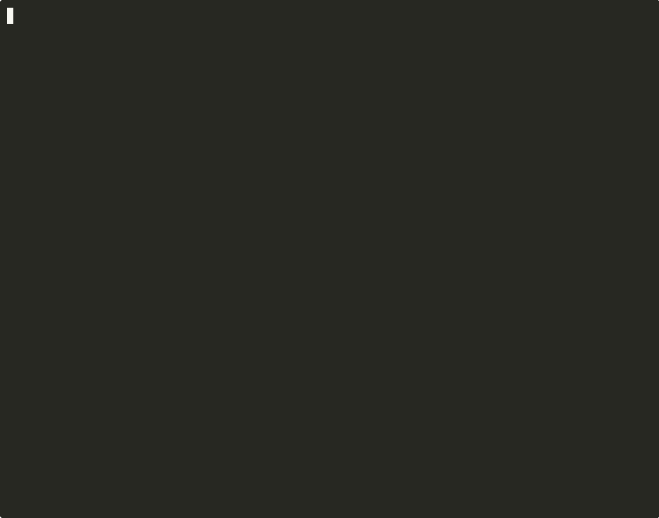

# Loom

Multi-agent thread orchestrator for [Claude Code](https://docs.anthropic.com/en/docs/claude-code).

Each agent is a full Claude Code session — own system prompt, own memory, own tools. Loom names the threads, routes messages between agents, snapshots state after every turn, and lets you rewind when things go wrong.



## Why

Claude Code is good at one thing at a time. Complex tasks need multiple angles: research, critique, synthesis. But managing multiple `claude --resume` sessions by hand is painful — you lose track of session IDs, can't route output between them, and one bad turn means starting over.

Loom fixes this. You sketch a workflow interactively, rewind when an agent goes off track, and once the flow works, wrap it in a bash script. Interactive debugging becomes automated pipeline.

## The workflow

**1. Sketch interactively**

```bash
loom init my-project && cd my-project
loom t AAPL do axe "AAPL: pull the 10-K and latest earnings transcript"
loom t AAPL do axe "what are the key forward factors?"
loom t AAPL do bobby hears axe "attack this thesis"
loom t AAPL do axe hears bobby
```

Each turn auto-snapshots. Every input and output is saved to disk. You can inspect exactly what was sent and received:

```bash
loom t AAPL read 2 --input   # what bobby received
loom t AAPL read 2            # what bobby said
loom t AAPL show              # full thread summary with timing and cost
```

**2. Rewind when it goes wrong**

Bobby's critique was weak. Rewind to after turn 1 and try a different approach:

```bash
loom t AAPL rewind 1                                    # roll back to after turn 1
loom t AAPL do bobby hears axe "be more specific. check the math on margins."
```

Rewind restores everything — agent memory, scratchpad files, even Claude's internal session state. It's like the bad turns never happened.

**3. Automate as a pattern**

Once the flow works, it's a bash script:

```bash
#!/bin/bash
# patterns/research.sh
INTAKE="${1:?usage: research.sh <intake> [model]}"
MODEL="${2:-opus}"
NAME="research-$(date +%s)"

loom t "$NAME" do axe "$INTAKE" --model "$MODEL"
loom t "$NAME" do axe "what are the driving forward factors" --model "$MODEL"
loom t "$NAME" do bobby hears axe "attack this thesis" --model "$MODEL"
loom t "$NAME" do axe hears bobby --model "$MODEL"
loom t "$NAME" do axe "write the memo" --use-system writer --model "$MODEL"
loom t "$NAME" show
```

Run it: `loom p research run "TSLA: autonomous driving" sonnet`

**4. Embed in your own code**

It's a [Rust crate](#rust-library) and [Python library](#python-library) too. Same agents, same rewind, same state — called from code instead of the terminal.

## Install

```bash
git clone https://github.com/bxxd/idio-loom.git
cd idio-loom
make build    # cargo build --release
make install  # copies to ~/.local/bin/loom
```

**Requires**: [Claude Code CLI](https://docs.anthropic.com/en/docs/claude-code) installed and authenticated, Rust toolchain.

**As a Rust dependency**: `idio-loom = { git = "https://github.com/bxxd/idio-loom.git" }`

**Python**: `pip install git+https://github.com/bxxd/idio-loom.git#subdirectory=python` (wraps CLI via subprocess, requires `loom` on PATH)

## Quickstart

```bash
git clone https://github.com/bxxd/idio-loom.git
cd idio-loom && make build && make install

mkdir my-project && cd my-project
loom init

# Run your first thread
loom t HELLO do axe "what is 2+2?" --model haiku
loom t HELLO do bobby hears axe "is this right?" --model haiku
loom t HELLO show
```

**Are you Claude?** Read `@DEVELOPER.md` for the full architecture, module map, and design decisions.

## Smoke test

```bash
loom init smoke-test && cd smoke-test
loom t TEST do axe "what is 2+2? answer in one sentence." --model haiku
loom t TEST do bobby hears axe "is this correct?" --model haiku
loom t TEST show
loom t TEST rm
```

Expected:

```
TEST (2 turns, 2 agents: axe, bobby)
  [0] axe haiku "what is 2+2? answer in one sentence." (3s, 12 chars $0.002)
  [1] bobby haiku < axe "is this correct?" (4s, 89 chars $0.003)
  ────────────────────────
  total: 7s, $0.005
```

## State and debugging

Every turn is saved to disk. Nothing is hidden.

```
.loom/runs/AAPL/
├── meta.json                    # session IDs, turn history
├── .last_output                 # most recent agent output
├── scratchpad/                  # shared workspace (RESEARCH.md, NOTES.md, ...)
├── axe.system.md                # axe's full system prompt (first turn)
├── bobby.system.md              # bobby's full system prompt
├── turn-0-axe.md                # turn 0 output
├── turn-0-axe.input.md          # turn 0 input (what was sent)
├── turn-1-axe.md
├── turn-1-axe.input.md
├── turn-2-bobby.md
├── turn-2-bobby.input.md
└── snapshots/
    ├── 0/                       # state after turn 0
    ├── 1/                       # state after turn 1
    └── 2/                       # state after turn 2
```

Snapshots include Claude's session JSONLs — rewind truly rolls back agent memory, not just loom's state.

```bash
loom t AAPL read 0            # axe's first output
loom t AAPL read 2 --input    # exactly what bobby received
loom t AAPL rewind 1          # undo turns 2+ (agents forget them too)
loom t AAPL snapshot          # manual snapshot (auto-snapshot is on by default)
loom t AAPL reset             # clear all turns, keep thread name
loom t AAPL rm                # delete everything
```

## CLI

```
loom
├── init [path] [--force]
├── list (ls)
├── agents [show <name>]
├── patterns (p) [<name> show | <name> run [args...]]
└── thread (t) <name>
    ├── do <agent> [hears <source>] ["nudge"]
    ├── show (default)
    ├── read [turn] [--input]
    ├── snapshot
    ├── rewind <N>
    ├── reset (clear)
    └── delete (rm)
```

**Flags**: `--model <model>`, `--use-system <agent>`, `--dir <path>`, `--input`/`-i`, `--force`/`-f`

**Env**: `LOOM_MODEL` — model override for scripts

**Aliases**: `t`=thread, `p`=patterns, `ls`=list, `rm`=delete, `clear`=reset

## Agents and routing

Agents are YAML files. Drop a file in `agents/`, it's available immediately.

```yaml
# agents/axe.yaml
model: opus
system_prompt: "@prompts/axe.txt"    # loads from agents/prompts/axe.txt
```

```yaml
# agents/bobby.yaml
model: sonnet
system_prompt: |
  You are an adversarial reviewer. Find gaps, check math, challenge assumptions.
  If the analysis survives your critique, say so. If not, explain specifically why.
```

**Message routing**:
- `do axe "investigate X"` — sends "investigate X" as user input
- `do bobby hears axe` — routes axe's last output to bobby as input
- `do axe hears all` — concatenates full thread excluding axe's own prior turns
- `do axe "focus on margins" --use-system writer` — uses writer's system prompt for this turn only, keeping axe's session context

**Model resolution**: `--model` flag > `LOOM_MODEL` env > agent YAML > loom.yaml default

## Workspace config

```yaml
# loom.yaml
model: sonnet              # default model
backend: claude            # which agent runs turns: claude (default) or pi
backend_bin: pi            # optional: override the backend binary (e.g. vizipi)
timeout: 900               # turn timeout (seconds)
workshop: .                # path to agents/ and patterns/
state: .loom               # path to state dir
snapshots: true            # auto-snapshot after each turn
cwd: /some/path            # agent working directory (optional — picks up CLAUDE.md/AGENTS.md, .mcp.json)
system_prompt: |           # appended to all agents (optional)
  Extra instructions here.
```

The `cwd` field is key for tool access — point it at a directory with `.mcp.json` and your agents get MCP servers, file access, whatever the backend supports.

## Backends

Loom orchestrates *turns*; a **backend** is the coding-agent CLI that runs them.
Pick one with `backend:` in `loom.yaml`.

- **`claude`** (default) — drives the [Claude Code](https://docs.anthropic.com/en/docs/claude-code) CLI. Sessions live under `~/.claude/projects/`.
- **`pi`** — drives [Pi](https://github.com/earendil-works/pi) (and downstream forks like vizipi; set `backend_bin: vizipi`). Loom assigns the session id (`--session-id`) and points pi at a loom-owned `--session-dir`, so snapshots/rewind need no per-cwd slug guesswork.

The killer feature — **rewind that rolls back the agent's own memory** — works on
both: loom snapshots the backend's session transcript after every turn and
restores it on rewind. Adding a new backend is one file implementing the
`Backend` trait (see `DEVELOPER.md`).

## Python library

```bash
pip install git+https://github.com/bxxd/idio-loom.git#subdirectory=python
```

Wraps the CLI via subprocess. Requires `loom` binary on PATH.

```python
from idio_loom import Loom, LoomTimeout, LoomError

loom = Loom(workspace="/path/to/workspace")
t = loom.thread("my-thread", model="opus", timeout=1200)

output = t.do("axe", "investigate AAPL")
output = t.do("bobby", hears="axe", nudge="attack this thesis")
output = t.do("axe", hears="bobby")
output = t.do("axe", "write a draft", system="writer")

print(t.step)          # completed turns (int)
print(t.last_output)   # last turn content
print(t.show())        # thread summary

t.rewind(2)            # undo turns after 2
t.reset()              # clear all turns
t.delete()             # remove thread
```

`t.do()` params: `agent`, `nudge=`, `hears=`, `system=`, `model=`, `timeout=`

## Rust library

```toml
idio-loom = { git = "https://github.com/bxxd/idio-loom.git" }
```

```rust
use idio_loom::config::Config;
use idio_loom::thread::{Thread, RunOpts};

let config = Config::load(Some("/path/to/workspace"))?;
let t = Thread::new(&config, "my-thread");

// Simple
let result = t.run("axe", Some("investigate AAPL"))?;
// result: output, session_id, elapsed_s, cost_usd

// Full options
let result = t.run_opts(&RunOpts {
    agent: "axe",
    nudge: Some("analyze this"),
    source: Some("bobby"),
    model: Some("opus"),
    system: None,
    stage: Some("research"),
    timeout: Some(1800),
})?;

t.show()?;                       // thread summary
t.read_turn(Some(2), false)?;   // turn 2 output
t.rewind("3")?;                  // rewind to after turn 3
t.delete()?;
```

## License

MIT
